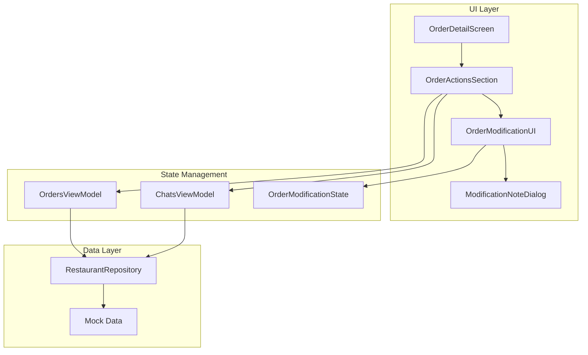
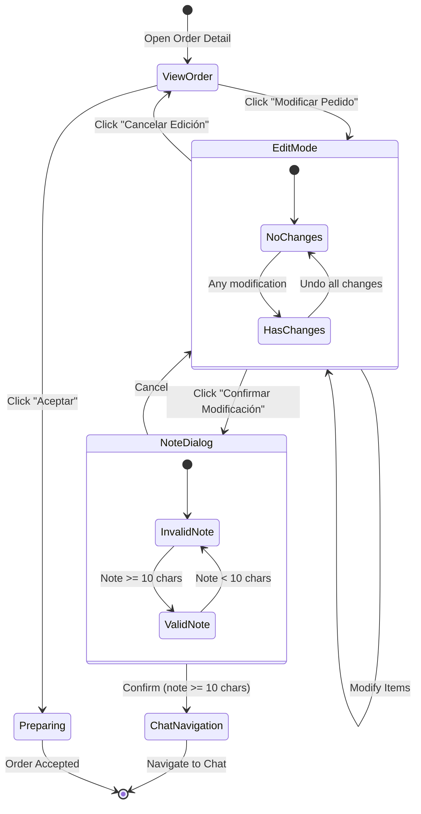

# Design Document: Order Modification Flow

## Overview

Este documento describe el diseño técnico para implementar el flujo mejorado de gestión de pedidos en la aplicación de negocios. Los cambios principales incluyen:

1. Simplificar la aceptación de pedidos (un clic, sin diálogos)
2. Transformar "Rechazar" en "Modificar Pedido" con edición interactiva de items
3. Control dinámico de botones según el estado de modificación
4. Nota obligatoria que se envía al chat del pedido
5. Navegación automática al chat después de confirmar modificaciones

## Architecture



## Components and Interfaces

### 1. OrderModificationState

Nuevo estado para manejar las modificaciones de un pedido:

```kotlin
data class OrderModificationState(
    val originalItems: List<OrderItem>,
    val modifiedItems: List<OrderItem>,
    val isEditMode: Boolean = false,
    val hasChanges: Boolean = false,
    val originalTotal: Double,
    val newTotal: Double
) {
    val totalDifference: Double get() = newTotal - originalTotal
    val hasPriceChange: Boolean get() = totalDifference != 0.0
}
```

### 2. ModifiedOrderItem

Wrapper para items con información de modificación:

```kotlin
data class ModifiedOrderItem(
    val orderItem: OrderItem,
    val modificationType: ModificationType,
    val originalQuantity: Int? = null,
    val originalInstructions: String? = null
)

enum class ModificationType {
    UNCHANGED,      // Sin cambios
    QUANTITY_CHANGED,  // Cantidad modificada
    INSTRUCTIONS_CHANGED, // Instrucciones modificadas
    ADDED,          // Item nuevo agregado
    REMOVED         // Item eliminado
}
```

### 3. OrderActionsSection (Modificado)

Actualizar la firma del componente para soportar el nuevo flujo:

```kotlin
@Composable
fun OrderActionsSection(
    order: Order,
    orderStatus: OrderStatus,
    modificationState: OrderModificationState?,
    availableMenuItems: List<MenuItem>,
    onAcceptOrder: () -> Unit,
    onEnterEditMode: () -> Unit,
    onExitEditMode: () -> Unit,
    onModifyItem: (OrderItem, Int, String?) -> Unit,
    onRemoveItem: (OrderItem) -> Unit,
    onAddItem: (MenuItem, Int, String?) -> Unit,
    onConfirmModification: (String) -> Unit,
    modifier: Modifier = Modifier
)
```

### 4. ChatsViewModel (Extensión)

Agregar método para crear mensaje de modificación:

```kotlin
fun createModificationMessage(
    orderId: String,
    orderNumber: String,
    customerName: String,
    modificationNote: String,
    modifiedItems: List<ModifiedOrderItem>,
    originalTotal: Double,
    newTotal: Double
): String
```

### 5. MessageType (Extensión)

Agregar nuevo tipo de mensaje:

```kotlin
enum class MessageType {
    TEXT,
    ORDER_CANCELLED,
    ORDER_MODIFIED  // Nuevo: Notificación de modificación de pedido
}
```

## Data Models

### OrderModificationMessage

Estructura del mensaje de modificación para el chat:

```kotlin
data class OrderModificationMessage(
    val note: String,
    val changes: List<ItemChange>,
    val originalTotal: Double,
    val newTotal: Double
)

data class ItemChange(
    val itemName: String,
    val changeType: ModificationType,
    val details: String // Ej: "Cantidad: 2 → 1" o "Eliminado"
)
```

### Mock Data Updates

Actualizar los datos de prueba para incluir:
- Pedidos PENDING con múltiples items variados
- Chats asociados a cada pedido
- Items de menú disponibles para agregar


## Correctness Properties

*A property is a characteristic or behavior that should hold true across all valid executions of a system—essentially, a formal statement about what the system should do. Properties serve as the bridge between human-readable specifications and machine-verifiable correctness guarantees.*

### Property 1: Accept Order State Transition

*For any* order in PENDING status, when the accept action is triggered, the order status SHALL change to PREPARING immediately without any intermediate states or dialogs.

**Validates: Requirements 1.1, 1.2**

### Property 2: Accept Button Visibility Invariant

*For any* order, the "Aceptar" button SHALL be visible if and only if the order status is PENDING.

**Validates: Requirements 1.3**

### Property 3: Edit Mode Activation

*For any* order in PENDING status, when "Modificar Pedido" is pressed, the modification state SHALL transition to edit mode (isEditMode = true).

**Validates: Requirements 2.2**

### Property 4: Item Modification Operations

*For any* order in edit mode:
- Changing quantity of an item SHALL update that item's quantity in modifiedItems
- Removing an item SHALL remove it from modifiedItems
- Adding a menu item SHALL add it to modifiedItems with the specified quantity
- Editing instructions SHALL update the specialInstructions field

**Validates: Requirements 2.3, 2.4, 2.5, 2.6**

### Property 5: Button State Consistency

*For any* modification state:
- IF hasChanges is false THEN "Confirmar Modificación" SHALL be disabled AND "Aceptar" SHALL be enabled
- IF hasChanges is true THEN "Confirmar Modificación" SHALL be enabled AND "Aceptar" SHALL be disabled

**Validates: Requirements 3.1, 3.2, 3.3**

### Property 6: Modification Note Validation

*For any* modification note string:
- IF length < 10 characters THEN the final confirmation button SHALL be disabled
- IF length >= 10 characters THEN the final confirmation button SHALL be enabled

**Validates: Requirements 4.2, 4.3**

### Property 7: Chat Message Content Completeness

*For any* confirmed modification with valid note, the resulting chat message SHALL contain:
- The modification note text
- A summary of all modified items (added, removed, changed)
- The original and new totals

**Validates: Requirements 5.1, 5.2, 5.3**

### Property 8: Total Calculation Correctness

*For any* modification state:
- Each item's subtotal SHALL equal (item.menuItem.price * item.quantity)
- The newTotal SHALL equal the sum of all modifiedItems subtotals
- The originalTotal SHALL remain unchanged from the initial order total

**Validates: Requirements 6.1, 6.2**

### Property 9: Cancel Edit Restoration (Round-Trip)

*For any* order that enters edit mode and has modifications applied, when "Cancelar Edición" is pressed:
- modifiedItems SHALL equal originalItems (deep equality)
- hasChanges SHALL be false
- isEditMode SHALL be false

**Validates: Requirements 7.2, 7.3**

## Error Handling

### User Input Errors

| Error Condition | Handling |
|----------------|----------|
| Empty modification note | Disable confirmation button, show character count |
| Note < 10 characters | Disable confirmation button, show remaining characters needed |
| No items remaining after removal | Show warning, prevent confirmation |
| Invalid quantity (0 or negative) | Prevent input, show validation message |

### System Errors

| Error Condition | Handling |
|----------------|----------|
| Failed to update order status | Show error toast, allow retry |
| Failed to send chat message | Show error dialog, allow retry or skip |
| Failed to load menu items | Show error, disable "Add Item" functionality |

### Edge Cases

- Order with single item: Allow removal but show warning before confirmation
- Order already modified by another user: Show conflict dialog, reload order
- Network timeout during confirmation: Show retry dialog with option to save locally

## Testing Strategy

### Unit Tests

Unit tests will verify specific examples and edge cases:

1. **Accept Order Flow**
   - Test accepting a PENDING order changes status to PREPARING
   - Test no dialog appears when accepting

2. **Button Visibility**
   - Test button states for each OrderStatus value
   - Test button states during edit mode

3. **Note Validation**
   - Test notes with 0, 9, 10, 11 characters
   - Test notes with only whitespace

4. **Total Calculations**
   - Test subtotal calculation with various quantities
   - Test total after adding/removing items

### Property-Based Tests

Property-based tests will use **fast-check** (or equivalent Kotlin library like **kotest-property**) to verify universal properties:

**Configuration:**
- Minimum 100 iterations per property test
- Tag format: **Feature: order-modification-flow, Property {number}: {property_text}**

1. **Property 1 Test**: Generate random PENDING orders, accept them, verify status is PREPARING
2. **Property 2 Test**: Generate orders with random statuses, verify button visibility matches PENDING status
3. **Property 5 Test**: Generate modification states with random changes, verify button states are consistent
4. **Property 6 Test**: Generate random strings, verify note validation matches length >= 10
5. **Property 8 Test**: Generate orders with random items and quantities, verify total calculations
6. **Property 9 Test**: Generate orders, apply random modifications, cancel, verify restoration

### Integration Tests

1. Full modification flow: Enter edit mode → Modify items → Add note → Confirm → Verify chat message
2. Cancel flow: Enter edit mode → Modify items → Cancel → Verify restoration
3. Accept flow: View PENDING order → Accept → Verify status change

## UI Flow Diagram


