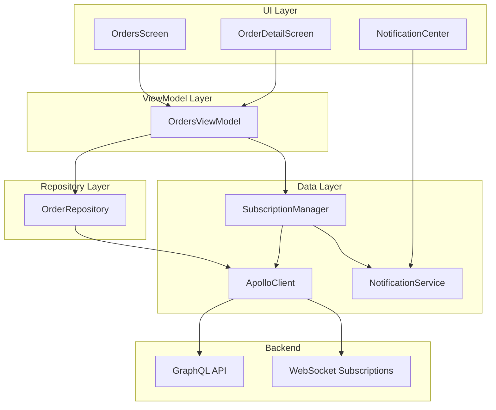

# Design Document: Orders Realtime Integration

## Overview

Este diseño describe la arquitectura para integrar el sistema de pedidos de la app de negocio con el backend GraphQL, eliminando todos los datos mock y habilitando actualizaciones en tiempo real mediante suscripciones GraphQL. El sistema permitirá recibir notificaciones de pedidos en cualquier sucursal del negocio con cambio rápido de contexto.

## Architecture



## Components and Interfaces

### 1. Data Models (Kotlin)

```kotlin
// Enum alineado con backend OrderStatusEnum
enum class OrderStatus {
    PENDING_ACCEPTANCE,
    MODIFIED_BY_STORE,
    ACCEPTED,
    PREPARING,
    READY_FOR_PICKUP,
    ON_THE_WAY,
    DELIVERED,
    CANCELLED;
    
    fun getDisplayName(): String = when (this) {
        PENDING_ACCEPTANCE -> "Pendiente"
        MODIFIED_BY_STORE -> "Modificado"
        ACCEPTED -> "Aceptado"
        PREPARING -> "Preparando"
        READY_FOR_PICKUP -> "Listo"
        ON_THE_WAY -> "En camino"
        DELIVERED -> "Entregado"
        CANCELLED -> "Cancelado"
    }
}

// Enum alineado con backend PaymentStatusEnum
enum class PaymentStatus {
    PENDING, VALIDATED, COMPLETED, FAILED
}

// Enum alineado con backend OrderActorEnum
enum class OrderActor {
    CUSTOMER, BUSINESS, SYSTEM, DELIVERY
}

// Enum alineado con backend DiscountTypeEnum
enum class DiscountType {
    PREMIUM, LEVEL, PROMO
}

@Serializable
data class Order(
    val id: String,
    val orderNumber: String,
    val customerId: String,
    val branchId: String,
    val businessId: String,
    val subtotal: Double,
    val deliveryFee: Double,
    val total: Double,
    val currency: String,
    val status: OrderStatus,
    val paymentMethod: String,
    val paymentStatus: PaymentStatus,
    val createdAt: String,
    val updatedAt: String,
    val lastStatusAt: String,
    val deliveryPersonId: String? = null,
    val estimatedDeliveryTime: String? = null,
    val paymentId: String? = null,
    val rating: Int? = null,
    val ratingComment: String? = null,
    val items: List<OrderItem>,
    val discounts: List<OrderDiscount>,
    val deliveryAddress: DeliveryAddress,
    val timeline: List<OrderTimelineEntry>,
    val comments: List<OrderComment>,
    val customer: CustomerInfo? = null,
    val branch: BranchInfo? = null,
    val business: BusinessInfo? = null,
    val deliveryPerson: DeliveryPersonInfo? = null,
    val isEditable: Boolean = false,
    val canCancel: Boolean = false,
    val estimatedMinutesRemaining: Int? = null
)

@Serializable
data class OrderItem(
    val productId: String,
    val name: String,
    val price: Double,
    val quantity: Int,
    val imageUrl: String,
    val wasModifiedByStore: Boolean = false
) {
    val lineTotal: Double get() = price * quantity
}

@Serializable
data class DeliveryAddress(
    val street: String,
    val city: String? = null,
    val reference: String? = null,
    val coordinates: Coordinates? = null
)

@Serializable
data class Coordinates(
    val type: String = "Point",
    val coordinates: List<Double> // [longitude, latitude]
) {
    val longitude: Double get() = coordinates.getOrNull(0) ?: 0.0
    val latitude: Double get() = coordinates.getOrNull(1) ?: 0.0
}

@Serializable
data class OrderTimelineEntry(
    val status: OrderStatus,
    val timestamp: String,
    val message: String,
    val actor: OrderActor
)

@Serializable
data class OrderComment(
    val id: String,
    val author: OrderActor,
    val message: String,
    val timestamp: String
)

@Serializable
data class OrderDiscount(
    val id: String,
    val title: String,
    val amount: Double,
    val type: DiscountType
)

@Serializable
data class CustomerInfo(
    val id: String,
    val name: String,
    val phone: String? = null,
    val avatarUrl: String? = null
)

@Serializable
data class DeliveryPersonInfo(
    val id: String,
    val name: String,
    val phone: String,
    val rating: Double,
    val totalDeliveries: Int,
    val vehicleType: String,
    val vehiclePlate: String? = null,
    val profileImageUrl: String? = null,
    val isOnline: Boolean,
    val currentLocation: Coordinates? = null
)

@Serializable
data class OrderStats(
    val totalOrders: Int,
    val completedOrders: Int,
    val cancelledOrders: Int,
    val totalRevenue: Double,
    val averageOrderValue: Double,
    val averageDeliveryTime: Int
)
```

### 2. GraphQL Operations

```graphql
# Queries
query BranchOrders(
    $branchId: String!
    $jwt: String!
    $status: OrderStatusEnum
    $fromDate: DateTime
    $toDate: DateTime
    $limit: Int!
    $offset: Int!
) {
    branchOrders(
        branchId: $branchId
        jwt: $jwt
        status: $status
        fromDate: $fromDate
        toDate: $toDate
        limit: $limit
        offset: $offset
    ) {
        orders {
            id
            orderNumber
            customerId
            branchId
            businessId
            subtotal
            deliveryFee
            total
            currency
            status
            paymentMethod
            paymentStatus
            createdAt
            updatedAt
            lastStatusAt
            deliveryPersonId
            estimatedDeliveryTime
            isEditable
            canCancel
            estimatedMinutesRemaining
            items {
                productId
                name
                price
                quantity
                imageUrl
                wasModifiedByStore
                lineTotal
            }
            discounts {
                id
                title
                amount
                type
            }
            deliveryAddress {
                street
                city
                reference
                coordinates {
                    type
                    coordinates
                }
            }
            timeline {
                status
                timestamp
                message
                actor
            }
            comments {
                id
                author
                message
                timestamp
            }
            customer {
                id
                name
                phone
                avatarUrl
            }
        }
        totalCount
        hasMore
    }
}

query PendingBranchOrders($branchId: String!, $jwt: String!) {
    pendingBranchOrders(branchId: $branchId, jwt: $jwt) {
        id
        orderNumber
        status
        total
        currency
        createdAt
        items {
            productId
            name
            quantity
            lineTotal
        }
        customer {
            name
            phone
        }
        deliveryAddress {
            street
        }
    }
}

query GetOrder($id: String!, $jwt: String!) {
    order(id: $id, jwt: $jwt) {
        # All fields from BranchOrders
    }
}

query OrderStats(
    $fromDate: DateTime!
    $toDate: DateTime!
    $jwt: String!
    $branchId: String
) {
    orderStats(
        fromDate: $fromDate
        toDate: $toDate
        jwt: $jwt
        branchId: $branchId
    ) {
        totalOrders
        completedOrders
        cancelledOrders
        totalRevenue
        averageOrderValue
        averageDeliveryTime
    }
}

# Mutations
mutation AcceptOrder($orderId: String!, $estimatedMinutes: Int!, $jwt: String!) {
    acceptOrder(orderId: $orderId, estimatedMinutes: $estimatedMinutes, jwt: $jwt) {
        id
        status
        updatedAt
    }
}

mutation RejectOrder($orderId: String!, $reason: String!, $jwt: String!) {
    rejectOrder(orderId: $orderId, reason: $reason, jwt: $jwt) {
        id
        status
        updatedAt
    }
}

mutation UpdateOrderStatus($input: UpdateOrderStatusInput!, $jwt: String!) {
    updateOrderStatus(input: $input, jwt: $jwt) {
        id
        status
        updatedAt
    }
}

mutation MarkOrderReady($orderId: String!, $jwt: String!) {
    markOrderReady(orderId: $orderId, jwt: $jwt) {
        id
        status
        updatedAt
    }
}

mutation ModifyOrderItems($input: ModifyOrderItemsInput!, $jwt: String!) {
    modifyOrderItems(input: $input, jwt: $jwt) {
        id
        status
        items {
            productId
            name
            price
            quantity
            wasModifiedByStore
            lineTotal
        }
        subtotal
        total
        updatedAt
    }
}

mutation AddOrderComment($input: AddOrderCommentInput!, $jwt: String!) {
    addOrderComment(input: $input, jwt: $jwt) {
        id
        comments {
            id
            author
            message
            timestamp
        }
    }
}

# Subscriptions
subscription NewBranchOrder($branchId: String!) {
    newBranchOrder(branchId: $branchId) {
        id
        orderNumber
        status
        total
        currency
        createdAt
        branchId
        items {
            name
            quantity
        }
        customer {
            name
        }
        deliveryAddress {
            street
        }
    }
}

subscription BranchOrderUpdated($branchId: String!) {
    branchOrderUpdated(branchId: $branchId) {
        id
        orderNumber
        status
        updatedAt
        lastStatusAt
    }
}
```

### 3. OrderRepository Interface

```kotlin
interface OrderRepository {
    // Queries
    suspend fun getBranchOrders(
        branchId: String,
        status: OrderStatus? = null,
        fromDate: String? = null,
        toDate: String? = null,
        limit: Int = 50,
        offset: Int = 0
    ): OrdersResult
    
    suspend fun getPendingBranchOrders(branchId: String): List<Order>
    
    suspend fun getOrder(orderId: String): Order?
    
    suspend fun getOrderStats(
        fromDate: String,
        toDate: String,
        branchId: String? = null
    ): OrderStats?
    
    // Mutations
    suspend fun acceptOrder(orderId: String, estimatedMinutes: Int): Result<Order>
    
    suspend fun rejectOrder(orderId: String, reason: String): Result<Order>
    
    suspend fun updateOrderStatus(
        orderId: String,
        status: OrderStatus,
        message: String? = null
    ): Result<Order>
    
    suspend fun markOrderReady(orderId: String): Result<Order>
    
    suspend fun modifyOrderItems(
        orderId: String,
        items: List<OrderItemInput>,
        reason: String
    ): Result<Order>
    
    suspend fun addOrderComment(orderId: String, message: String): Result<Order>
    
    // Subscriptions
    fun subscribeToNewOrders(branchId: String): Flow<Order>
    
    fun subscribeToOrderUpdates(branchId: String): Flow<Order>
}

sealed class OrdersResult {
    data class Success(
        val orders: List<Order>,
        val totalCount: Int,
        val hasMore: Boolean
    ) : OrdersResult()
    
    data class Error(val message: String) : OrdersResult()
}
```

### 4. SubscriptionManager

```kotlin
class SubscriptionManager(
    private val apolloClient: ApolloClient,
    private val notificationService: NotificationService
) {
    private val activeSubscriptions = mutableMapOf<String, Job>()
    private val _newOrders = MutableSharedFlow<NewOrderEvent>()
    val newOrders: SharedFlow<NewOrderEvent> = _newOrders.asSharedFlow()
    
    private val _orderUpdates = MutableSharedFlow<OrderUpdateEvent>()
    val orderUpdates: SharedFlow<OrderUpdateEvent> = _orderUpdates.asSharedFlow()
    
    fun subscribeToAllBranches(branchIds: List<String>, activeBranchId: String) {
        // Cancel existing subscriptions
        cancelAllSubscriptions()
        
        // Subscribe to each branch
        branchIds.forEach { branchId ->
            subscribeToNewOrders(branchId, isActiveBranch = branchId == activeBranchId)
            subscribeToOrderUpdates(branchId)
        }
    }
    
    fun updateActiveBranch(newActiveBranchId: String) {
        // Update notification behavior for active branch
    }
    
    private fun subscribeToNewOrders(branchId: String, isActiveBranch: Boolean) {
        val job = scope.launch {
            apolloClient.subscription(NewBranchOrderSubscription(branchId))
                .toFlow()
                .collect { response ->
                    response.data?.newBranchOrder?.let { order ->
                        val event = NewOrderEvent(
                            order = order.toOrder(),
                            branchId = branchId,
                            isActiveBranch = isActiveBranch
                        )
                        _newOrders.emit(event)
                        notificationService.showNewOrderNotification(event)
                    }
                }
        }
        activeSubscriptions["new_$branchId"] = job
    }
    
    fun cancelAllSubscriptions() {
        activeSubscriptions.values.forEach { it.cancel() }
        activeSubscriptions.clear()
    }
}

data class NewOrderEvent(
    val order: Order,
    val branchId: String,
    val isActiveBranch: Boolean
)

data class OrderUpdateEvent(
    val orderId: String,
    val branchId: String,
    val newStatus: OrderStatus,
    val updatedAt: String
)
```

### 5. NotificationService Interface

```kotlin
interface NotificationService {
    fun showNewOrderNotification(event: NewOrderEvent)
    fun showOrderUpdateNotification(orderId: String, status: OrderStatus)
    fun updateBadgeCount(pendingCount: Int)
    fun playNewOrderSound()
}

// Platform-specific implementations
expect class NotificationServiceImpl : NotificationService
```

### 6. OrdersViewModel Updates

```kotlin
class OrdersViewModel(
    private val tokenManager: TokenManager,
    private val orderRepository: OrderRepository,
    private val subscriptionManager: SubscriptionManager,
    private val branchContext: BranchContext
) : ViewModel() {
    
    private val _orders = MutableStateFlow<List<Order>>(emptyList())
    val orders: StateFlow<List<Order>> = _orders.asStateFlow()
    
    private val _uiState = MutableStateFlow<OrdersUiState>(OrdersUiState.Loading)
    val uiState: StateFlow<OrdersUiState> = _uiState.asStateFlow()
    
    private val _selectedStatus = MutableStateFlow<OrderStatus?>(null)
    val selectedStatus: StateFlow<OrderStatus?> = _selectedStatus.asStateFlow()
    
    private val _dateRange = MutableStateFlow<DateRange?>(null)
    val dateRange: StateFlow<DateRange?> = _dateRange.asStateFlow()
    
    init {
        observeActiveBranch()
        observeNewOrders()
        observeOrderUpdates()
    }
    
    private fun observeActiveBranch() {
        viewModelScope.launch {
            branchContext.activeBranch.collect { branch ->
                branch?.let {
                    loadOrders(it.id)
                    subscriptionManager.updateActiveBranch(it.id)
                }
            }
        }
    }
    
    private fun observeNewOrders() {
        viewModelScope.launch {
            subscriptionManager.newOrders.collect { event ->
                if (event.branchId == branchContext.activeBranch.value?.id) {
                    // Add to list if it's the active branch
                    _orders.update { currentOrders ->
                        listOf(event.order) + currentOrders
                    }
                }
            }
        }
    }
    
    private fun observeOrderUpdates() {
        viewModelScope.launch {
            subscriptionManager.orderUpdates.collect { event ->
                _orders.update { currentOrders ->
                    currentOrders.map { order ->
                        if (order.id == event.orderId) {
                            order.copy(
                                status = event.newStatus,
                                updatedAt = event.updatedAt
                            )
                        } else order
                    }
                }
            }
        }
    }
    
    fun loadOrders(branchId: String? = null) {
        val targetBranchId = branchId ?: branchContext.activeBranch.value?.id ?: return
        
        viewModelScope.launch {
            _uiState.value = OrdersUiState.Loading
            
            when (val result = orderRepository.getBranchOrders(
                branchId = targetBranchId,
                status = _selectedStatus.value,
                fromDate = _dateRange.value?.fromDate,
                toDate = _dateRange.value?.toDate
            )) {
                is OrdersResult.Success -> {
                    _orders.value = result.orders
                    _uiState.value = OrdersUiState.Success
                }
                is OrdersResult.Error -> {
                    _uiState.value = OrdersUiState.Error(result.message)
                }
            }
        }
    }
    
    fun acceptOrder(orderId: String, estimatedMinutes: Int) {
        viewModelScope.launch {
            _uiState.value = OrdersUiState.ActionInProgress(orderId)
            
            orderRepository.acceptOrder(orderId, estimatedMinutes)
                .onSuccess { updatedOrder ->
                    updateOrderInList(updatedOrder)
                    _uiState.value = OrdersUiState.Success
                }
                .onFailure { error ->
                    _uiState.value = OrdersUiState.ActionError(error.message ?: "Error al aceptar pedido")
                }
        }
    }
    
    fun rejectOrder(orderId: String, reason: String) {
        viewModelScope.launch {
            _uiState.value = OrdersUiState.ActionInProgress(orderId)
            
            orderRepository.rejectOrder(orderId, reason)
                .onSuccess { updatedOrder ->
                    updateOrderInList(updatedOrder)
                    _uiState.value = OrdersUiState.Success
                }
                .onFailure { error ->
                    _uiState.value = OrdersUiState.ActionError(error.message ?: "Error al rechazar pedido")
                }
        }
    }
    
    fun markOrderReady(orderId: String) {
        viewModelScope.launch {
            _uiState.value = OrdersUiState.ActionInProgress(orderId)
            
            orderRepository.markOrderReady(orderId)
                .onSuccess { updatedOrder ->
                    updateOrderInList(updatedOrder)
                    _uiState.value = OrdersUiState.Success
                }
                .onFailure { error ->
                    _uiState.value = OrdersUiState.ActionError(error.message ?: "Error al marcar como listo")
                }
        }
    }
    
    fun setStatusFilter(status: OrderStatus?) {
        _selectedStatus.value = status
        loadOrders()
    }
    
    fun setDateRange(range: DateRange?) {
        _dateRange.value = range
        loadOrders()
    }
    
    private fun updateOrderInList(updatedOrder: Order) {
        _orders.update { currentOrders ->
            currentOrders.map { order ->
                if (order.id == updatedOrder.id) updatedOrder else order
            }
        }
    }
}

sealed class OrdersUiState {
    object Loading : OrdersUiState()
    object Success : OrdersUiState()
    data class Error(val message: String) : OrdersUiState()
    data class ActionInProgress(val orderId: String) : OrdersUiState()
    data class ActionError(val message: String) : OrdersUiState()
}

data class DateRange(
    val fromDate: String,
    val toDate: String
)
```

## Data Models

Los modelos de datos están definidos en la sección de Components and Interfaces. Los principales son:

- `Order` - Modelo principal del pedido con todos los campos del backend
- `OrderItem` - Item individual del pedido
- `DeliveryAddress` - Dirección de entrega con coordenadas
- `OrderTimelineEntry` - Entrada del historial de estados
- `OrderComment` - Comentario en el pedido
- `OrderDiscount` - Descuento aplicado
- `CustomerInfo` - Información del cliente
- `DeliveryPersonInfo` - Información del repartidor
- `OrderStats` - Estadísticas de pedidos

## Correctness Properties

*A property is a characteristic or behavior that should hold true across all valid executions of a system-essentially, a formal statement about what the system should do. Properties serve as the bridge between human-readable specifications and machine-verifiable correctness guarantees.*

### Property 1: Model Serialization Round-Trip

*For any* valid Order object with all its nested objects (OrderItem, DeliveryAddress, OrderTimelineEntry, OrderComment, OrderDiscount), serializing to JSON and then deserializing back SHALL produce an equivalent object.

**Validates: Requirements 1.1, 1.2, 1.3, 1.4, 1.5, 1.6**

### Property 2: Status Filter Correctness

*For any* status filter applied to a list of orders, all orders in the filtered result SHALL have that exact status.

**Validates: Requirements 2.3, 9.3**

### Property 3: Date Range Filter Correctness

*For any* date range filter (fromDate, toDate) applied to orders, all orders in the result SHALL have createdAt within that range (inclusive).

**Validates: Requirements 2.4, 9.4**

### Property 4: Pagination Limit Correctness

*For any* pagination request with limit N, the number of orders returned SHALL be less than or equal to N.

**Validates: Requirements 2.5**

### Property 5: New Order List Update

*For any* new order received via subscription for the active branch, the order list SHALL contain that order after the update.

**Validates: Requirements 3.3**

### Property 6: Order Update Propagation

*For any* order update received via subscription, the corresponding order in the list SHALL reflect the new status and updatedAt values.

**Validates: Requirements 3.4**

### Property 7: Valid State Transitions - Accept

*For any* order with status PENDING_ACCEPTANCE, calling acceptOrder SHALL result in status ACCEPTED or PREPARING.

**Validates: Requirements 5.1**

### Property 8: Valid State Transitions - Reject

*For any* order with status PENDING_ACCEPTANCE, calling rejectOrder SHALL result in status CANCELLED.

**Validates: Requirements 5.2**

### Property 9: Valid State Transitions - Ready

*For any* order with status PREPARING, calling markOrderReady SHALL result in status READY_FOR_PICKUP.

**Validates: Requirements 5.4**

### Property 10: Editable Order Constraint

*For any* order, the edit button SHALL be visible if and only if isEditable is true.

**Validates: Requirements 6.1**

### Property 11: Item Quantity Modification

*For any* order item and valid positive quantity, modifying the quantity SHALL update the item's quantity to that value.

**Validates: Requirements 6.3**

### Property 12: Item Removal

*For any* order with N items, removing one item SHALL result in N-1 items in the order.

**Validates: Requirements 6.4**

### Property 13: Item Addition

*For any* order with N items and a valid product from the catalog, adding that product SHALL result in N+1 items in the order.

**Validates: Requirements 6.5**

### Property 14: Total Recalculation

*For any* modification to order items (add, remove, change quantity), the new total SHALL equal the sum of (price * quantity) for all items plus deliveryFee minus discounts.

**Validates: Requirements 6.7**

### Property 15: Comments Chronological Order

*For any* list of order comments, they SHALL be ordered by timestamp in descending order (most recent first).

**Validates: Requirements 7.1**

### Property 16: Timeline Chronological Order

*For any* order timeline, entries SHALL be ordered by timestamp in descending order (most recent first).

**Validates: Requirements 8.3**

### Property 17: Status Display Name Mapping

*For any* OrderStatus enum value, getDisplayName() SHALL return a non-empty localized string.

**Validates: Requirements 9.5**

### Property 18: Notification Branch Data

*For any* notification for an order in a non-active branch, the notification data SHALL contain both branchId and orderId.

**Validates: Requirements 12.1**

### Property 19: Subscription Coverage

*For any* business with N branches, the SubscriptionManager SHALL maintain exactly 2*N active subscriptions (newBranchOrder + branchOrderUpdated for each branch).

**Validates: Requirements 3.7**

## Error Handling

### Network Errors
- Retry automático con backoff exponencial para queries fallidas
- Reconexión automática de suscripciones WebSocket
- Cache local de último estado conocido para mostrar datos offline

### Validation Errors
- Validación de estimatedMinutes > 0 antes de acceptOrder
- Validación de reason no vacío antes de rejectOrder
- Validación de items no vacíos antes de modifyOrderItems

### State Errors
- Verificar estado actual antes de permitir transiciones
- Mostrar mensaje si la acción no es válida para el estado actual
- Refrescar pedido si hay conflicto de estado

### UI Error States
```kotlin
sealed class OrderActionError {
    data class NetworkError(val message: String) : OrderActionError()
    data class ValidationError(val field: String, val message: String) : OrderActionError()
    data class StateConflict(val currentStatus: OrderStatus, val attemptedAction: String) : OrderActionError()
    data class PermissionDenied(val reason: String) : OrderActionError()
}
```

## Testing Strategy

### Unit Tests
- Mappers de GraphQL response a modelos Kotlin
- Lógica de filtrado local
- Cálculo de totales en modificación de items
- Validaciones de transiciones de estado

### Property-Based Tests
Se usará **Kotest** con su módulo de property testing para Kotlin Multiplatform.

Configuración mínima: 100 iteraciones por propiedad.

Cada test debe estar anotado con el formato:
```kotlin
// Feature: orders-realtime-integration, Property N: [property description]
```

Properties a implementar:
1. Round-trip serialization para todos los modelos
2. Filtrado por estado retorna solo pedidos con ese estado
3. Filtrado por fecha retorna pedidos dentro del rango
4. Paginación respeta el límite
5. Nuevos pedidos se agregan a la lista
6. Actualizaciones se propagan correctamente
7. Transiciones de estado válidas
8. Cálculo de totales correcto
9. Ordenamiento cronológico de comments y timeline
10. Mapeo de nombres de estado

### Integration Tests
- Queries GraphQL contra backend de staging
- Mutations con verificación de respuesta
- Suscripciones con eventos simulados

### UI Tests
- Flujo de aceptar pedido
- Flujo de rechazar pedido
- Flujo de modificar items
- Cambio de sucursal desde notificación

